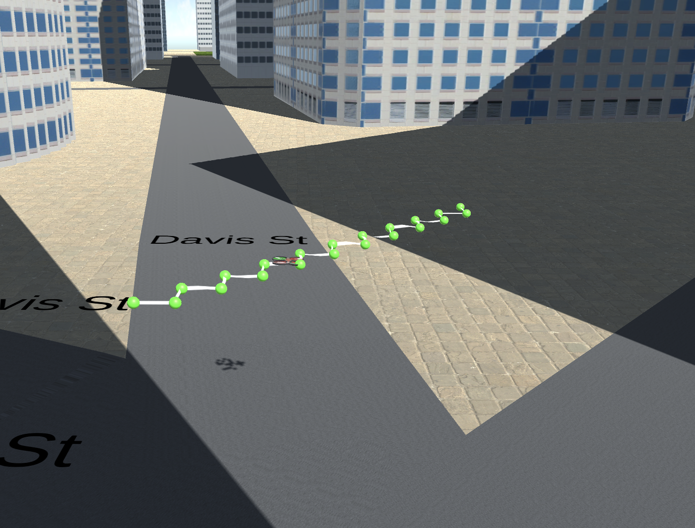
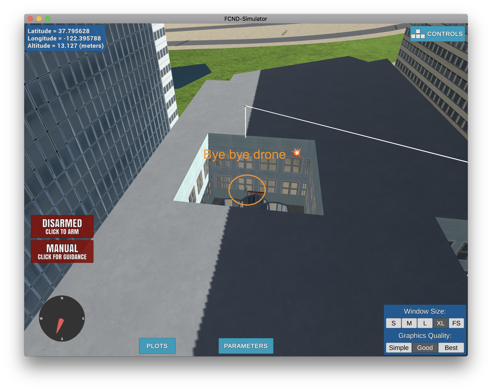

## Project: 3D Motion Planning


---

### Explain the Starter Code

#### 1. Explain the functionality of what's provided in `motion_planning.py` and `planning_utils.py`



Let's review the functionality of the provided files:

**motion_planning.py**

In general the file is very similar to `backyard_flyer_solution`. One of the main differences being that the `States` enum includes an additional `PLANNING` state

In the `plan_path` method which is called once the drone is armed, we enter the `PLANNING` state, read the grid of obstacles from our CSV file, and set a goal of 10m NE from our start position, before running A\* to get there.

One of the quirks of this setup is if you move around and then execute the script, it always tries to go back to the center of the map before executing the flightplan.

**planning_utils.py**

The planning utils file contains several useful utilities, the 2 main ones include `create_grid` and `a_star`. The `a_star` method includes with it an `Actions` classs and `valid_actions` method to help it traverse our grid. The default implementation of A\* only knows about 4 directions and can't yet go diaganol, hence the jagged path seen above.

**States**

Here is a list of possible states the drone can be in:

| State     | Purpose                    | Order |
| --------- | -------------------------- | ----- |
| MANUAL    | Allow manual flight        | 1     |
| ARMING    | Starting the drone w/props | 2     |
| PLANNING  | Figure out where to go     | 3     |
| TAKEOFF   | Start at initial altitude  | 4     |
| WAYPOINT  | Flying between waypoints   | 5     |
| LANDING   | Goal found, heading down   | 6     |
| DISARMING | Turning off props          | 7     |

### Implementing Your Path Planning Algorithm

#### 1. Set your global home position

The top of the `colliders.csv` file contains a line like this:

```c
lat0 37.792480, lon0 -122.397450
posX,posY,posZ,halfSizeX,halfSizeY,halfSizeZ
```

We needed to extract that lat and lon and use it to set the home position for our drone, so that our position from that time forward would be correctly measured from this location. Here's how I accomplished it:

```py
with open('colliders.csv') as f:
    _, lat0, _, lon0 = f.readline().replace(",", " ").replace("\n", "").split()
self.set_home_position(float(lon0), float(lat0), 0)
```

The part that got me was longitude first. I kept trying latittude first and it messed up my calculations. Whoops.

#### 2. Set your current local position

I didn't get this for a long time, but the `global_to_local` function basically converts latititude / longitude to grid coordinates.

```py
local_pos = global_to_local(self.global_position, self.global_home)
```

#### 3. Set grid start position from local position

Calculating the local position comes in handy later when we need to determine where we are on the grid (for calculating A\*):

```py
grid_start = (int(-north_offset + local_pos[0]), int(-east_offset + local_pos[1]))
```

#### 4. Set grid goal position from geodetic coords

I added a `--goal` argument to our script, so that I can try different destinations such as:

* `python motion_planning.py --goal="-122.396846, 37.797240, 0"`
* `python motion_planning.py --goal="-122.398950, 37.794191, 23"`
* `python motion_planning.py --goal="-122.395744, 37.795635, 23"`

The default destination when we run `python motion_planning.py` is `"-122.396846, 37.797240, 0"` and is shown below:


#### 5. Modify A* to include diagonal motion (or replace A* altogether)

I used the prescribed solution of adding diaganols to the `Action` Enum in `planning_utils` as follows:

```py
NW = (-1, -1, np.sqrt(2))
NE = (-1, 1, np.sqrt(2))
SW = (1, -1, np.sqrt(2))
SE = (1, 1, np.sqrt(2))
```

Where it got kind of weird though was in our `valid_actions` method we had to add a bunch of logic to check for collisions:

```py
if x - 1 < 0 or y + 1 > m or grid[x - 1, y + 1] == 1:
    valid_actions.remove(Action.NE)
if x + 1 > n or y + 1 > m or grid[x + 1, y + 1] == 1:
    valid_actions.remove(Action.SE)
if x - 1 < 0 or y - 1 < 0 or grid[x - 1, y - 1] == 1:
    valid_actions.remove(Action.NW)
if x + 1 > n or y - 1 < 0 or grid[x + 1, y - 1] == 1:
    valid_actions.remove(Action.SW)
```

#### 6. Cull waypoints

I finally figured out how to use Bresenham. Here's how my implementation works.

I have two methods `bresify_path` and `safe_bres`. The first one looks through all of the waypoints provided by our A\* method. Beginning with the first point checks (using the `safe_bres` method to see if it can reach the next waypoint without a collision. It keeps track of all of the safe waypoints, so that once it does find one that collides, it starts the process again at the last safe waypoint.

This gets me from something like 600 paths down to around 15 for most paths.

I think there are optimizations we can do to make this even faster, such as using binary search to try optimize finding safe waypoints, but I timed it and realized it's pretty fast already.


### Execute the flight

#### 1. Does it work?

It works!

### Double check that you've met specifications for each of the [rubric](https://review.udacity.com/#!/rubrics/1534/view) points.

I think I got everything. I even added a `DEADZONE` variable and found it works a little bit better at 3m rather than 1m, though I didn't play with this much.

# Extra Challenges: Takeoff and Landing from Buildings


For extra credit I decided to support starting and landing on buildings.

The basic way that this works is that I shoved all the non-obstacle grid coordinates in a `KDTree` and then queried for the nearest safe point near the starting and landing points. This is similar to work we did on some of our graph exercises.

Once we had a safe start and end point I was able to run A\* and get a safe path through the grid. The only thing left was to code up the actual landing and take-off sequences, because they were separate to the grid waypoints provided by A\*/Bresenham.

```python
# 2 points when starting at altitude
starting_points = [(start_point[0], start_point[1], start_point[2] + altitude, 0),
    (close_to_start[0], close_to_start[1], start_point[2] + altitude)]

# 3 points to end at altitude
ending_points = [(close_to_end[0], close_to_end[1], end_point[2] + altitude),
                    (end_point[0], end_point[1], end_point[2] + altitude),
                    (end_point[0], end_point[1], end_point[2])]

# and later we just concat these with the waypoints...
self.waypoints = starting_points + waypoints + ending_points
```

### Challenges Implementing Takeoff from Altitude

While the idea I had was correct I ran into a few hurdles which I will outline in more detail.

1.  Our A\* implementation is very obstacle averse. Even when the height of our goal is 3m and our traveling altitude is 5m, the safety distance will prevent us from creating a path to that destination.

2.  Also `local_position_callback` wasn't taking altitude into account when determing if you found a waypoint, which means that if you're trying to straight up from a waypoint it will think you're already there and crash into the building try to diagnaolly travel to the next waypoint.


3.  Next up `velocity_callback` which triggers landing only wanted to initiate landing when you were below `0.1` meters altitude for both `local_position` and `global_position`. This meant that while I could get the drone to hover near a roof it would never stop.

4.  The initial take-off altittude was initially being set to `TARGET_ALTITUDE` and so we needed to modify that to take into account the local_altitude.

### Bugs

Even with all of those things in place there are still some limitations, such as this case, where we try to land in the middle of a building and it will either crash or drop down ;-)




But hey it will make it (though probably damaged)


Try it yourself at `python motion_planning.py --goal="-122.395744, 37.795635, 23"`
